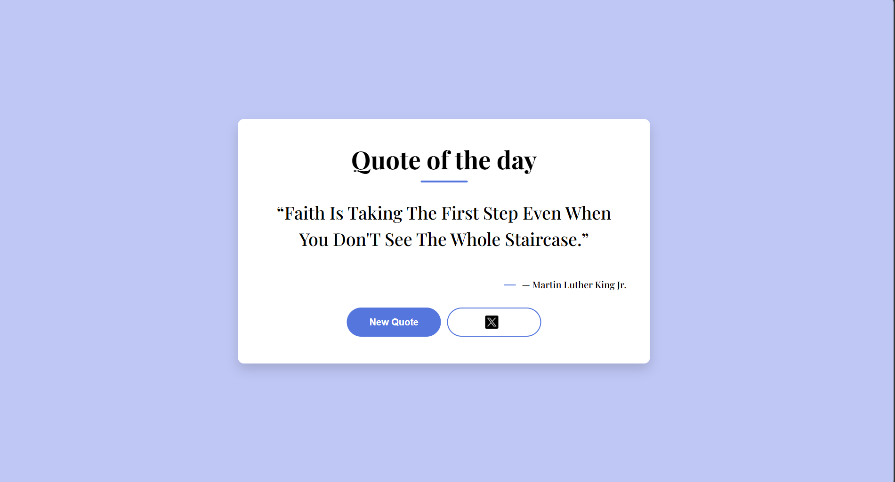

 CodeAlpha App Development Internship

This repository contains the tasks completed during my CodeAlpha App Development Internship.

Task 1 – Quote Generator

A responsive Quote Generator built using HTML, CSS and JavaScript.

 Features :

- Random quote generation
- Displays quote author
- Share quote on X (Twitter)
- Responsive design
- Error handling
- Clean UI

 Technologies Used :

- HTML5
- CSS3
- JavaScript (ES6)
- Fetch API
- Git
- GitHub

 Screenshot:

 Live Demo:

https://mahak01-coder.github.io/codealpha_tasks/

 Repository:

https://github.com/mahak01-coder/codealpha_tasks

 Author :

**Mahak Bansal**

GitHub: https://github.com/mahak01-coder
